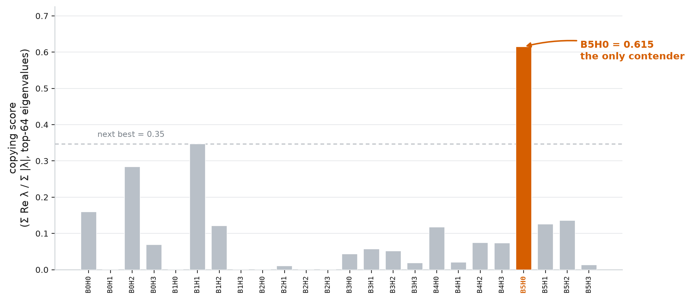
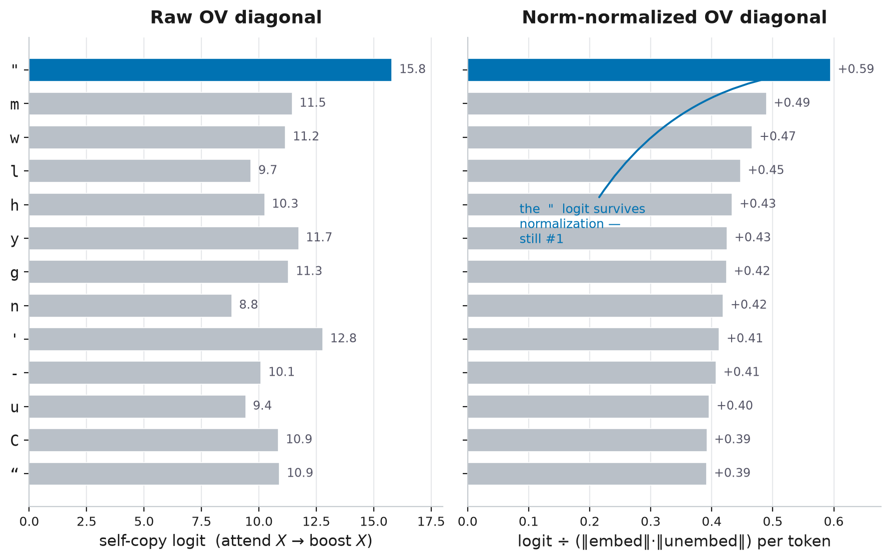
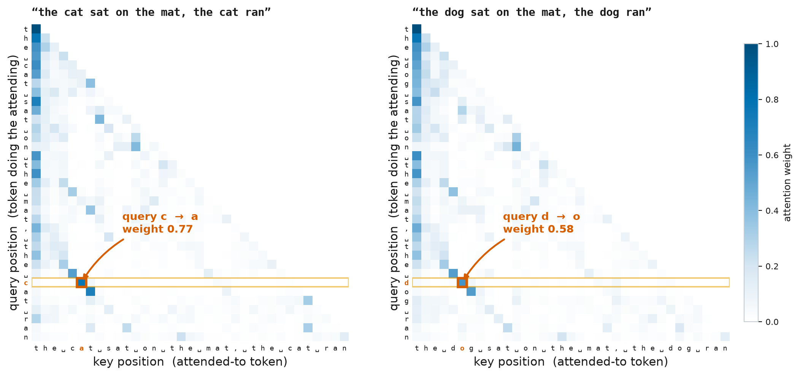
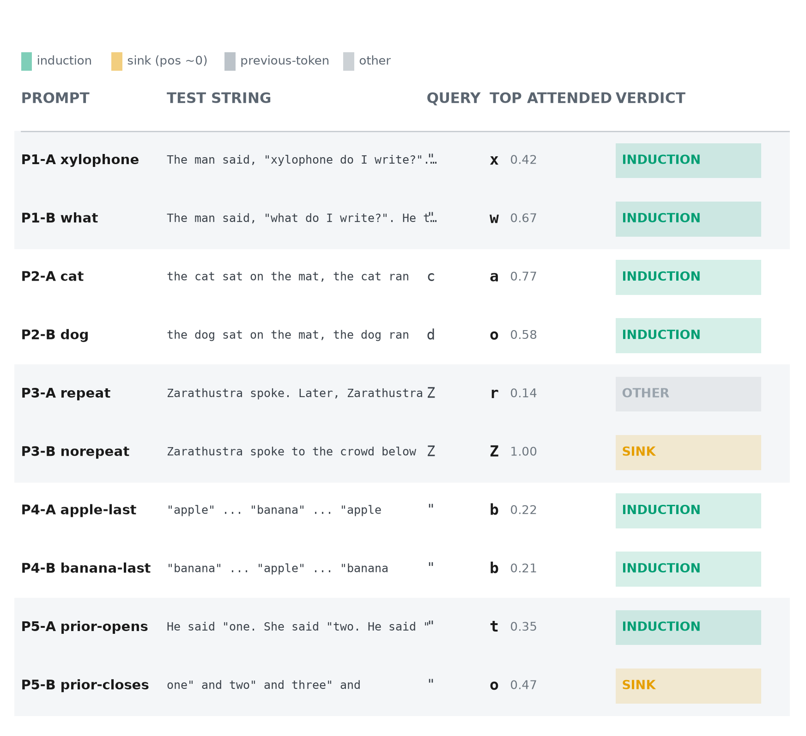
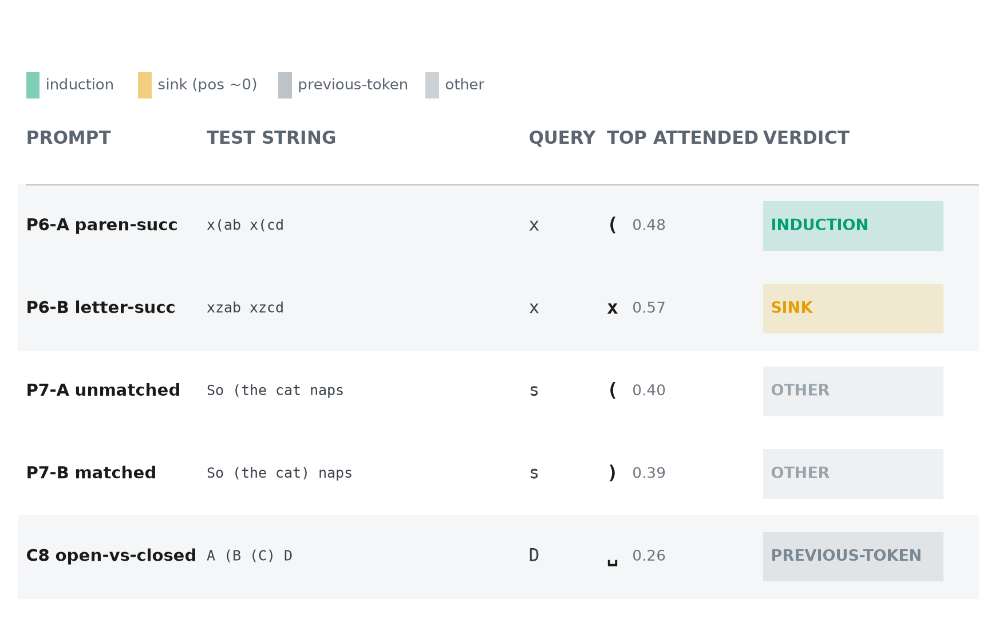

# An Induction Head in Disguise: Chasing Grammar in a Character-Level Transformer

*Confident in the measurements — copying score, OV logits, attention patterns. More exploratory on the interpretations of what the head "knows," two of which I ended up disconfirming myself. My first mechanistic interpretability post; corrections welcome.*

I trained a small character level transformer on Nietzsche texts, and now I interpret on it. Numbers can be flattering, but it's the control that breaks, diverts, or makes a conclusion. In trying to understand a particular head in a custom transformer, the conclusion changed frequently. We chased a copying head, quotation grammar, and parenthesis grammar, with the latter two disconfirmed. The takeaway is having identified a copying head with the OV circuit half of a bracket-completion mechanism, but a QK circuit insufficient to route the attention needed to complete it.

## The setup

The transformer is basically a residual stream with 6 blocks feeding into it, and an embed matrix and unembed matrix on either side. Each block contains 4 attention heads, and a general MLP of Linear, Activation, Linear. This post focuses on just the attention heads, which can be separated into 2 key mechanisms, the QK and OV circuits. The QK circuit is how the head decides what to attend to within the current and previous tokens. The OV circuit decides that given we are attending to a specific token, what token should be boosted when picking the next one.

## Finding a copying head

The elusive copying head is the first goal, utilizing the eigenvalue method proposed in the paper "A Mathematical Framework for Transformer Circuits" (Elhage et al.). Iterating through all blocks and heads, we compute the eigenvalues for the OV circuit matrix. A positive eigenvalue means that passing an eigenvector through the OV matrix results in a scaled vector, in the same direction. In other words, it is the same token representation. However the eigenvalues can range to complex numbers as well. So for one head, there can be a mix of complex, positive, and negative eigenvalues. From here, we have to compute a kind of copying score to better characterize whether a head is copying. It is just taking the sum of the head's eigenvalue real parts (up to the matrix's rank, 64 here) and dividing by the sum of their magnitudes. The imaginary part of complex eigenvalues will drive this to 0. **B5H0 (Block 5 Head 0) is identified as the only contender.**

Concretely, for head $h$ the OV circuit is the token-to-token map

$$W_{\mathrm{OV}} = W_U W_O^{h} W_V^{h} W_E ,$$

whose eigenvalues $\lambda_1, \dots, \lambda_n$, sorted by magnitude and truncated to the top $r$ (the matrix rank), give

$$\text{copying score} = \frac{\sum_{i=1}^{r} \operatorname{Re}(\lambda_i)}{\sum_{i=1}^{r} \lvert \lambda_i \rvert} , \qquad r = \frac{d_{\mathrm{model}}}{n_{\mathrm{head}}} = 64 .$$

With a copying score of 0.615, a spike relative to the others, it proposes the idea that a copying head does exist. Naturally, you would ask what it copies.

*Copying score for every block-by-head combination across all 24 attention heads; B5H0 spikes to 0.615 while the next-highest head sits at 0.35.*

## What does it copy?

Eigenvectors are a dead end. They're already in token basis, so it's readable. However, to do that we need to cancel out the norms of the embed and unembed matrices which dominate the reading. But we can't do this with eigenvectors because it mixes all tokens together, there isn't a scalar value to cancel out the norms. So we divert to reading logits directly off the diagonal of the OV circuit — entry $(i, j)$ of $W_{\mathrm{OV}}$ is how much attending to token $j$ boosts token $i$, so the diagonal is each token's self-copy strength while an off-diagonal entry is one token boosting a different one. Here we can divide out the norms of the embed and unembed matrices, because the diagonal is per-token, we can compute the norms per token as well. This reveals high logits for many tokens, solidifying its status as a copying head.

*Raw versus norm-normalized OV self-copy logits for B5H0's top tokens; dividing out the embed and unembed norms sharpens the copy signal instead of deflating it, and the quote logit stays at the top.*

## Quote grammar

But beyond that, it had the highest logit for quotes at 0.594. This means that when attending to `"`, the logit for `"` goes up. Maybe this head knows quotation grammar, the rules are simple enough, every quote just needs to be paired. It just needs to be shown that the QK circuit attends to unpaired `"` over other characters. So we throw in a couple test sentences — a handful of hand-written prompts, not a systematic sweep, so read these controls as suggestive rather than conclusive — and read off the attending tokens from B5H0's attention pattern. But this control reveals the head attends to tokens that follow previous iterations of the query token. **So quote grammar was a dead end, but also proves this head to be an induction head.**

*B5H0 attention on a content-swap pair; the bright induction cell tracks the swapped token (cat to 'a', dog to 'o'), the query attending to the character that followed the query's own prior occurrence.*

*Per-prompt verdicts for the quote tests; the top attended token is the induction successor rather than a matching quote, with the honest misses and position-0 sinks kept in. Two stay in: P3-A (repeat) tops out on 'r' at $w = 0.14$ — a genuine miss, not the induction successor — while P3-B (norepeat) and P5-B (prior-closes) collapse onto the position-0 attention sink (up to $w = 1.00$) when no induction cue is present.*

## Parenthesis grammar

Before writing it off completely, the OV self-copy logits for the brackets are also interesting:

- `(` at $+0.227$ — the OV circuit copies open brackets,
- `)` at $-0.339$ — and suppresses close brackets.

So it may be able to create opening parenthesis structures while preventing unnecessary closing ones. This reads as a semblance of parenthesis grammar, but not quite. Checking the logit of ')' when attending to '(' and vice versa could fill in those blanks:

- attending to `(` *increases* the logit for `)` at $+0.556$,
- attending to `)` *decreases* the logit for `(` at $-0.105$.

This could be learned parenthesis grammar. The most notable is the 0.556, when it sees an open parenthesis, it wants to close it. It is tempting, it looks very much like parenthesis grammar. If QK reliably attends to parentheses, and better yet if it can understand parenthesis structure, it is basically what we've been chasing after. So similar to quote analysis, we throw in a couple sentences and check the attending tokens. And the QK circuit generally does attend to parentheses, but not meaningfully enough to be considered grammar. **The head doesn't understand bracket positioning, and just attends to the latest parenthesis.** This also holds back the nested grammar that the diagonal suggested, nested parentheses require bracket position understanding, specifically depth tracking to know when to close parentheses.

*Per-prompt verdicts for the parenthesis tests; B5H0 attends to brackets but never distinguishes one that still needs closing from one already closed, so it just tracks the latest bracket. The near-ties the verdict column hides: in C8 (`A (B (C) D`) the still-open '(' at position 2 ($w = 0.11$) loses to the already-closed '(' at position 5 ($w = 0.12$), so there is no depth tracking; and P7 unmatched ('(' at 3, $w = 0.40$) versus matched ('(' at 3, $w = 0.18$; ')' at 11, $w = 0.39$) shows attention following the latest bracket, not whether it needs closing.*

## What the head actually is

**As we said initially, this is a copying head with an OV circuit that knows how to handle parentheses, but the QK circuit is blind to bracket structure, and thus can't utilize it properly.** It's a small, concrete example of a mechanism sitting half-built in the weights — the OV circuit here already "knows" bracket completion — yet functionally inert because a second circuit never learned to feed it: the kind of latent, partial structure worth watching for when we reason about what a model can and can't do.
